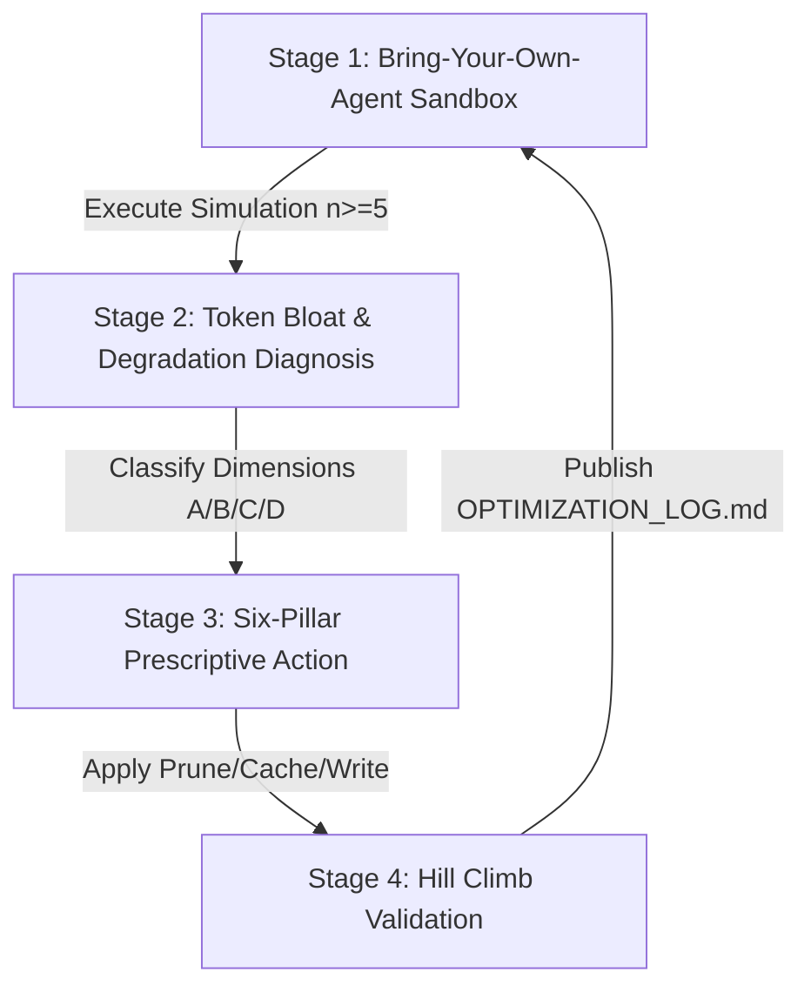
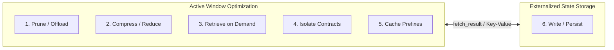

# Enterprise Sandbox & Hill Climb Platform: Solving Context Explosion & Token Bloat

Welcome to the **Context Optimization & Evaluation Platform** for enterprise agent architectures.

**Executive Summary:** 
As agentic applications transition from research prototypes to production systems, the primary bottleneck is **Context Explosion and Token Bloat**. Unmanaged multi-turn dialogue histories, unpruned tool payloads, static system prompt bloat, and sub-agent state inheritance cause prompt token consumption to scale quadratically. This leads to prohibitive billing, severe latency spikes, and cognitive degradation known as **Context Rot** (e.g., "Lost in the Middle" retrieval lapses).

This refocused platform provides an end-to-end sandbox, diagnostic engine, and six-pillar optimization framework to rigorously evaluate and remediate context window degradation across an iterative **Hill Climb Methodology (M0 Baseline → M5 Fully Optimized)**.



---

## 1. The Six Pillars of Context Engineering

Traditional context optimization frames engineering purely as a reduction exercise (trimming tokens). However, aggressive trimming silently drops core facts, risking functional failure. To preserve accuracy while optimizing costs, this platform introduces the **Write** pillar to externalize memory.



1. **Prune & Offload (Tool Payload Explosion)**: Move data refinement out of the context window into deterministic execution using strict Pydantic response models and JSONPath truncation.
2. **Compress & Reduce (Conversation History Rot)**: Maintain raw prompt/response pairs for the 2 most recent turns, collapsing earlier turns into a running executive summary.
3. **Retrieve on Demand (Static Prompt Bloat)**: Avoid packing base prompts with static domain manuals. Inject rules dynamically via lightweight RAG tools at runtime.
4. **Isolate Contracts (Sub-Agent State Duplication)**: Pass minimal Data Transfer Object (DTO) contracts (`{"intent": "...", "parameters": {...}}`) between sub-agents instead of prompt history inheritance.
5. **Cache Prefixes (TTFT & Cost Maximization)**: Consolidate static personas and tool definitions at the absolute top of system prompts (excluding dynamic timestamps) to maximize Vertex AI Prompt KV-Caching.
6. **Write & Persist (External Long-Term Memory)**: Give the agent explicit tools (`write_user_profile`, `fetch_result(id)`) to save durable customer facts to an external Key-Value database and reference large intermediate calculation tables losslessly.

---

## 2. Advanced Context Degradation Failure Modes

Beyond basic token bloat, our automated diagnostic engine (`agent-eval`) evaluates three advanced failure modes:
* **Context Poisoning**: A hallucinated or outdated fact enters early conversation history and compounds across turns. Remediation requires strict tool validation and prompt ejection rules.
* **Context Distraction**: Over-attending to bloated history while ignoring core instructions or tools. Remediation requires rigid per-component token budgeting.
* **Context Clash**: Contradictory information accumulates across turns (e.g. user changes their preference). Poor compaction erases the correction but retains conflicting statements. Remediation requires external Key-Value state reconciliation.

---

## 3. Getting Started: The 4-Stage Workflow

### Stage 1: Run Enterprise Scenario Suites
```bash
cd customer-service
uv sync

# Run multi-iteration user simulation across enterprise scenario suites (n=5 runs)
uv run agent-eval run --agent-dir customer_service \
  --scenarios-file eval/scenarios/suite/tool_heavy_workflow.json \
  --session-input-file eval/scenarios/session_input.json --runs 5
```

### Stage 2: Convert Simulation Traces
```bash
cd ../evaluation
uv sync
uv run agent-eval convert --agent-dir ../customer-service/customer_service --output-dir ../customer-service/eval/results
```

### Stage 3: Evaluate Metrics
```bash
RUN_DIR=$(ls -td ../customer-service/eval/results/*/ | head -1)
uv run agent-eval evaluate --interaction-file ${RUN_DIR}raw/processed_interaction_sim.jsonl \
  --metrics-files ../customer-service/eval/metrics/metric_definitions.json --results-dir ${RUN_DIR}
```

### Stage 4: Analyze & Generate Hill Climb Logs
```bash
uv run agent-eval analyze --results-dir ${RUN_DIR} --agent-dir ../customer-service --location global
```
This automatically updates `customer-service/eval/results/OPTIMIZATION_LOG.md` with statistical variance (`mean ± stdev`), dollar cost savings, per-component token attributions, and non-monotonic milestone tracking.

---

## 4. Deep Dive Reference
For full CLI documentation, metric mapping schemas, financial formulas, and custom metric creation instructions, refer to [REFERENCE.md](REFERENCE.md).
