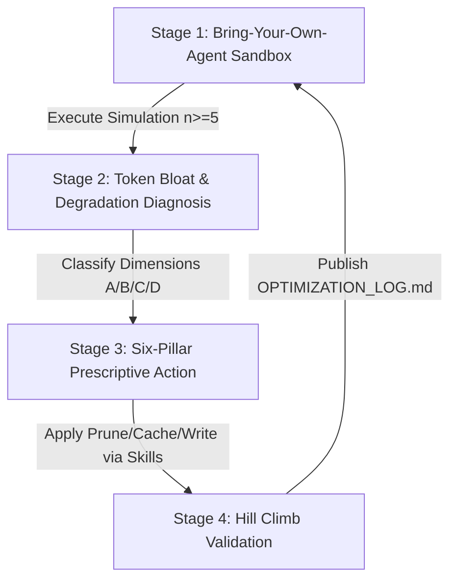
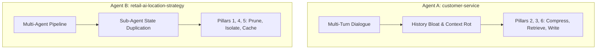
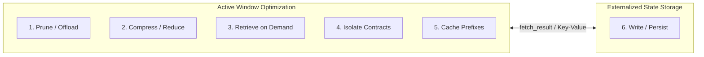

# Context Optimization & Hill Climb Platform: Solving Context Explosion & Token Bloat

Welcome to the **Context Optimization & Evaluation Platform** for enterprise agent architectures.

As generative AI applications transition from lightweight prototypes to production-scale systems, the primary engineering bottleneck shifts from prompt refinement to **Context Explosion and Token Bloat**. Unmanaged conversation histories, verbose tool payloads, monolithic system prompts, and redundant sub-agent state handoffs cause active token consumption to scale quadratically. This results in prohibitive API costs, extreme latency spikes, and severe cognitive degradation known as **Context Rot** (e.g., "Lost in the Middle" retrieval failures, context distraction, and state clashing).

This platform provides an end-to-end sandbox, diagnostic evaluation engine (`agent-eval`), interactive visualization dashboard, and structured skill collection to rigorously measure, diagnose, and remediate context window degradation across an iterative **Hill Climb Methodology (M0 Baseline → M5 Fully Optimized)**.



---

## 1. Project Setup & Overall Architecture

The platform is explicitly structured into modular, decoupled packages separating the evaluation engine from the domain agent runtimes, interactive dashboards, and agent-guided optimization skills.

```
context_optimisation_strategy_sample/
├── README.md                           # Executive overview & structural guide
├── REFERENCE.md                        # Architectural deep dive, CLI flags & financial equations
├── GEMINI.md                           # Master context document for AI assistants
├── evaluation/                         # Evaluation CLI & Diagnostics Engine (agent-eval)
├── customer-service/                   # Agent A: Multi-Turn Conversational Agent (Stateful)
├── retail-ai-location-strategy/        # Agent B: Multi-Stage Synthesis Pipeline (Stateless)
├── dashboard/                          # Plotly & Gradio interactive visualization scorecard
└── skills/                             # Structured markdown skill guides for agent optimization
```

### Which Part is Doing What?

* **`evaluation/` (The Diagnostics Engine)**: Provides the core Python evaluation framework and CLI tool (`agent-eval`). It handles trace conversion, deterministic scale tracking (caching rates, dollar costs, latency), per-component token attributions, automated rule-based failure diagnosis, and LLM-as-Judge prompt rubrics using Vertex AI.
* **`customer-service/` (Agent A)**: A stateful, multi-turn ADK agent modeling retail support. Features custom tools (`tools.py`, `memory_tools.py`, `rag_tools.py`) designed to test conversation rolling buffers and Key-Value external persistence.
* **`retail-ai-location-strategy/` (Agent B)**: A complex, multi-stage LangGraph/CopilotKit pipeline routing tasks across specialized sub-agents. Designed to test Data Transfer Object (DTO) isolation contracts and large-scale document caching.
* **`dashboard/` (The Analytics UI)**: A full Gradio application (`dashboard.py`) that flattens nested JSON log structures to provide reactive scorecards, interactive bar charts, and raw data grids comparing baseline vs. candidate runs.
* **`skills/` (The Optimization Guidebook)**: Expert system guidance files (`context-compression-skills.md`, `context-optimisation-skills.md`, `memory-systems-skill.md`, `tool-design-skill.md`) used by agents to systematically evaluate and optimize codebase components.

---

## 2. Why Two Agents? Are They Both Necessary?

**Yes! Both agents are strictly necessary.** They embody the two distinct architectural paradigms in enterprise AI, each suffering from fundamentally different mechanisms of context window collapse:



### Agent A (`customer-service`): Multi-Turn Stateful Dialogue
* **The Vulnerability**: Long conversational trajectories (10+ turns) generate immense message history rot. Unpruned database queries (like shopping cart contents) create severe tool payload explosion.
* **The Validation**: Stress-tests **Pillar 2 (Compress/Rolling Buffers)**, **Pillar 3 (Dynamic RAG Grounding)**, and **Pillar 6 (External Key-Value Persist Store)**. Demonstrates how to prevent the model from "forgetting" early customer preferences across long chat sessions.

### Agent B (`retail-ai-location-strategy`): Multi-Stage Multi-Agent Pipeline
* **The Vulnerability**: Deep single-turn pipelines routing massive tasks across specialized sub-agents (Intake → Market Research → Competitor Mapping → Gap Analysis → Report Generation). Passing full parent prompts to every sub-agent causes catastrophic token duplication and static prompt bloat.
* **The Validation**: Stress-tests **Pillar 1 (Pydantic Tool Pruning)**, **Pillar 4 (Data Transfer Object Isolation Contracts)**, and **Pillar 5 (Prompt KV-Caching static prefix headers)**. Demonstrates how to isolate sub-agent state and achieve 85%+ cache hit rates on system instructions.

---

## 3. The Six Pillars of Context Engineering

Traditional context optimization frames engineering purely as a reduction exercise (trimming tokens). However, aggressive trimming silently drops core facts, risking functional failure. To preserve accuracy while optimizing costs, this platform introduces the **Write** pillar to externalize memory.



1. **Prune & Offload (Tool Payload Explosion)**: Move data refinement out of the context window into deterministic execution using strict Pydantic response models and JSONPath truncation.
2. **Compress & Reduce (Conversation History Rot)**: Maintain raw prompt/response pairs for the 2 most recent turns, collapsing earlier turns into a running executive summary buffer.
3. **Retrieve on Demand (Static Prompt Bloat)**: Avoid packing base prompts with static domain manuals. Inject rules dynamically via lightweight RAG tools at runtime.
4. **Isolate Contracts (Sub-Agent State Duplication)**: Pass minimal Data Transfer Object (DTO) contracts (`{"intent": "...", "parameters": {...}}`) between sub-agents instead of prompt history inheritance.
5. **Cache Prefixes (TTFT & Cost Maximization)**: Consolidate static personas and tool definitions at the absolute top of system prompts (excluding dynamic timestamps) to maximize Vertex AI Prompt KV-Caching.
6. **Write & Persist (External Long-Term Memory)**: Give the agent explicit tools (`write_user_profile`, `fetch_result(id)`) to save durable customer facts to an external Key-Value database and reference large intermediate calculation tables losslessly.

---

## 4. Where Are the Metrics?

The evaluation framework evaluates agents simultaneously across two distinct metric categories:

### 1. Deterministic Scale & Financial Metrics
Located directly inside the evaluation core engine (`evaluation/src/evaluation/core/deterministic_metrics.py`). These calculate objective infrastructural and financial efficiency without requiring LLM inference:
* `total_tokens` & `prompt_tokens`: Master context window scale.
* `latency_metrics.average_turn_latency_seconds`: Multi-turn response speed.
* `cache_efficiency.cache_hit_rate`: Success rate of Prompt KV-Caching.
* `cost_per_turn_usd` & `projected_cost_per_1k_sessions_usd`: Explicit financial billing splits accounting for discounted cached token pricing tiers.
* **Per-Component Token Attribution**: Tracks precise prompt token allocation across 5 buckets: `System`, `Tool-Defs`, `History`, `RAG`, and `Tool-Results`.

### 2. LLM-as-Judge Quality Guardrails
Configured in customizable JSON metric schemas inside each agent's evaluation suite:
* **Customer Service Suite**: `customer-service/eval/metrics/metric_definitions.json`
* **Retail AI Suite**: `retail-ai-location-strategy/eval/metrics/metric_definitions.json`
* **Top-Level Framework Templates**: `evaluation/templates/metric_definitions.json`

These definitions instruct Vertex AI evaluators to act as an LLM judge, assigning 0–5 point rubrics across core quality dimensions:
* `end_to_end_task_success`: Verifies if the user's primary goal was fulfilled.
* `fact_retention_probe`: Needle-in-a-haystack recall test verifying if early constraints survived compaction buffers.
* `context_degradation_guard`: Explicitly diagnoses **Context Poisoning** (hallucinated facts entering summary loops), **Context Distraction** (ignoring system instructions due to history bloat), and **Context Clash** (failing to reconcile user preference updates).

---

## 5. How to Run, Analyze & Update Metrics

### Step 1: Run Multi-Run Sandbox Simulations ($n=5$)
To ensure statistical rigor, all baseline and optimized states must be run $n \ge 5$ times.
```bash
cd customer-service
uv sync

# Clear old simulation history before running a new evaluation batch
rm -rf customer_service/.adk/eval_history/*

# Execute multi-run user simulation across enterprise scenario suites
uv run agent-eval run --agent-dir customer_service \
  --scenarios-file eval/scenarios/suite/tool_heavy_workflow.json \
  --session-input-file eval/scenarios/session_input.json --runs 5
```

### Step 2: Convert ADK Traces to Evaluation Dataset
```bash
cd ../evaluation
uv sync

# Parse raw nested JSON traces into structured JSONL format
uv run agent-eval convert --agent-dir ../customer-service/customer_service --output-dir ../customer-service/eval/results
```

### Step 3: Evaluate Metrics & Guardrails
```bash
# Locate the timestamped run directory generated by the convert command
RUN_DIR=$(ls -td ../customer-service/eval/results/*/ | head -1)

# Execute deterministic and LLM-as-Judge evaluation rubrics
uv run agent-eval evaluate --interaction-file ${RUN_DIR}raw/processed_interaction_sim.jsonl \
  --metrics-files ../customer-service/eval/metrics/metric_definitions.json --results-dir ${RUN_DIR}
```

### Step 4: Analyze Results & Publish Optimization Logs
```bash
# Generate root-cause analysis and automated non-monotonic Hill Climb logs
uv run agent-eval analyze --results-dir ${RUN_DIR} --agent-dir ../customer-service --location global
```

### What Are the Results?
After running the analysis command, four primary evaluation deliverables are automatically produced or updated:
1. `[agent]/eval/results/[timestamp]/eval_summary.json`: The raw aggregated JSON output containing standard deviations (`mean ± stdev`).
2. `[agent]/eval/results/[timestamp]/gemini_analysis.md`: Qualitative AI root-cause analysis diagnosing underlying tool explosion or context distraction.
3. `[agent]/eval/results/OPTIMIZATION_LOG.md`: Master non-monotonic Hill Climb tracking log comparing M0 Baseline through M5 Optimized states, demonstrating exact token deltas, cost reductions, and quality regressions/rebounds with visual delta emojis (🟢/🔴/⚪).
4. **Interactive Dashboard**: Run `uv run dashboard.py` inside `dashboard/` to open a local web browser interface comparing experiments with Plotly charts and reactive scorecards.

---

### How to Update or Add Custom Metrics

You can easily add new quality guardrails or update scoring rubrics without modifying Python code. Open `[agent]/eval/metrics/metric_definitions.json` and append your custom metric block:

```json
{
  "metrics": {
    "complex_guideline_adherence": {
      "metric_type": "llm",
      "score_range": {
        "min": 0,
        "max": 5,
        "description": "0=Completely ignored instructions, 5=Perfect compliance across all edge cases"
      },
      "dataset_mapping": {
        "full_conversation": {"source_column": "extracted_data:conversation_history"},
        "final_output": {"source_column": "final_response"}
      },
      "template": "Analyze the full conversation history. Verify whether the agent strictly adhered to the mandatory operational boundary regarding unapproved bulk discounts..."
    }
  }
}
```
When you next run `agent-eval evaluate`, the CLI automatically parses this definition, invokes the Vertex AI judge, and publishes the new metric score into your `eval_summary.json`.

---

## 6. Deep Dive References

For further architectural details, CLI parameter guides, custom tool schemas, and mathematical financial formulas, consult:
* [REFERENCE.md](REFERENCE.md) - Architectural deep dive & financial metrics
* [GEMINI.md](GEMINI.md) - Optimization guidance & prompt setup context
* `skills/` - Master domain skills for agent memory, compression, and tool design
