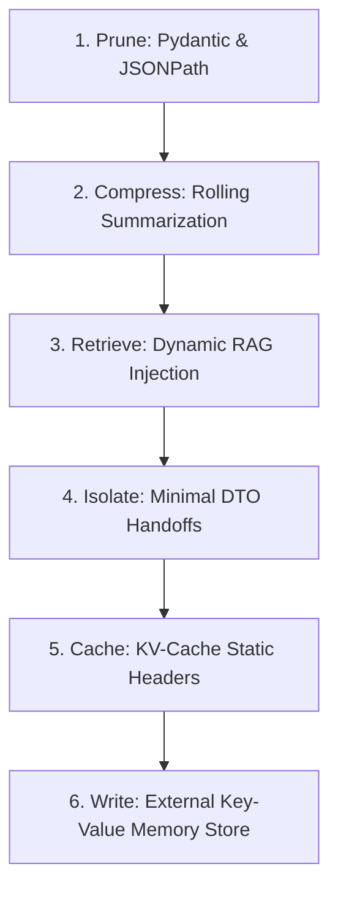

# Agent Evaluation & Context Optimization Reference Guide

Deep-dive documentation for the `agent-eval` CLI, the **Six Pillars of Context Engineering**, advanced degradation metrics, financial calculations, and custom metric schemas.

---

## Table of Contents
1. [Environment Setup](#environment-setup)
2. [CLI Reference & Runner Architecture](#cli-reference)
3. [The Six Pillars of Context Engineering](#six-pillars-deep-dive)
4. [Advanced Context Degradation Model](#degradation-model)
5. [Enterprise Financial ($) Metrics](#financial-metrics)
6. [Creating Custom Quality Guardrails](#creating-custom-metrics)
7. [Understanding Non-Monotonic Progression](#non-monotonic-progression)

---

## Environment Setup

### Prerequisites
* **Python**: 3.10–3.12 (Python 3.13+ pending compatibility)
* **Package Manager**: `uv` (run `uv sync` in `evaluation/`, `customer-service/`, or `retail-ai-location-strategy/`)
* **Google Cloud**: Validated Vertex AI credentials via `gcloud auth application-default login`

```
+------------------------------------------------------------------+
|  WARNING: You MUST use Vertex AI, not API keys                   |
|                                                                  |
|  Required environment variables:                                 |
|    GOOGLE_CLOUD_PROJECT=your-project-id                          |
|    GOOGLE_CLOUD_LOCATION=us-central1 (or global for Gemini 3)    |
|                                                                  |
|  API keys bypass Vertex AI trace interception and evaluation.    |
+------------------------------------------------------------------+
```

---

## CLI Reference & Runner Architecture

| Command | Purpose | Specialized Capabilities |
| :--- | :--- | :--- |
| `agent-eval run` | Orchestrate multi-run user simulation | Accepts `--runs` ($n=5$), `--order`, and `--ablation` flags. Cleans up `.adk/eval_history/*`. |
| `agent-eval convert` | Convert ADK history to JSONL | Converts nested JSON traces into `processed_interaction_sim.jsonl`. |
| `agent-eval interact` | Run interactions against live endpoints | Evaluates remote services or single-turn pipeline APIs. |
| `agent-eval evaluate` | Evaluate deterministic and LLM metrics | Computes population variance (`mean ± stdev`). |
| `agent-eval analyze` | Generate Gemini diagnosis & hill climb logs | Invokes automated context diagnoser and publishes `OPTIMIZATION_LOG.md`. |

---

## The Six Pillars of Context Engineering



### 1. Prune (Tool Payload Explosion)
Unpruned tool payloads inject tens of thousands of raw JSON tokens into prompt history. Wrap tool returns in strict Pydantic response models and JSONPath expressions to truncate extraneous metadata blobs.

### 2. Compress (Conversation History Rot)
Storing raw conversation turns across 10+ turn dialogues results in quadratic token scaling. Apply rolling summarization buffers: maintain raw prompt/response pairs for the 2 most recent turns, while collapsing Turns 3..N into an executive LLM summary.

### 3. Retrieve (Static Prompt Bloat)
Avoid packing base prompts with static domain manuals. Implement dynamic RAG grounding tools to inject instructions *only* when active, ejecting them immediately upon task completion.

### 4. Isolate (Sub-Agent State Duplication)
When routing tasks to specialized sub-agents, do not pass full parent prompt histories. Pass clean Data Transfer Object (DTO) contracts (`{"intent": "...", "parameters": {...}}`).

### 5. Cache (Prefix Optimization)
Position static instructions, personas, and tool definitions at the absolute top of system prompts (excluding dynamic timestamps) to maximize Vertex AI Prompt KV-Caching. Caching slashes Time-To-First-Token (TTFT) and reduces per-token billing by up to 90%.

### 6. Write (Durable External Memory)
Give the agent explicit tools (`write_user_profile`, `fetch_result(id)`) to save durable customer facts to an external Key-Value database (`eval/results/memory_store/`) and reference large intermediate calculation tables losslessly.

---

## Advanced Context Degradation Model

Beyond basic token inflation and "Lost in the Middle" recall lapses, the platform's diagnostic engine evaluates three advanced failure modes:

* **Context Poisoning**: A hallucinated or incorrect fact enters early conversation history. Due to repetition across turns or inclusion in running summaries, the model repeatedly re-references the incorrect datum, compounding the error.
* **Context Distraction**: As conversation history bloats to tens of thousands of tokens, the attention mechanism over-attends to peripheral chat history while ignoring core operational boundaries or tool declarations.
* **Context Clash**: Contradictory information accumulates across turns (e.g., a customer corrects an order preference). Poor compaction erases the explicit correction but retains initial conflicting statements.

---

## Enterprise Financial ($) Metrics

Our deterministic metrics engine (`deterministic_metrics.py`) explicitly tracks financial efficiency triggers across cached vs. uncached token pricing structures:
* `cost_per_turn_usd`: Exact financial cost per dialogue interaction.
* `projected_cost_per_1k_sessions_usd`: Master financial projection.
* `uncached_cost_usd` vs. `cached_cost_usd`: Explicitly isolates active prompt token billing from Prompt KV-Caching rates (~10-25% of list price).

**Per-Component Token Attribution**: Provides a precise per-turn breakdown of prompt tokens across five buckets: `System`, `Tool-Defs`, `History`, `RAG`, and `Tool-Results`.

---

## Creating Custom Quality Guardrails

To prevent token optimization from silently breaking core agent capabilities, configure custom guardrails in `metric_definitions.json`:

```json
{
  "metrics": {
    "end_to_end_task_success": {
      "metric_type": "llm",
      "score_range": {"min": 0, "max": 5, "description": "0=Goal unfulfilled, 5=Perfect task execution"},
      "dataset_mapping": {
        "user_inputs": {"source_column": "user_inputs"},
        "response": {"source_column": "final_response"},
        "full_conversation": {"source_column": "extracted_data:conversation_history"}
      },
      "template": "Evaluate whether the core intent was successfully fulfilled without dropping key sub-tasks..."
    },
    "fact_retention_probe": {
      "metric_type": "llm",
      "score_range": {"min": 0, "max": 5, "description": "0=Total memory loss, 5=Perfect needle retrieval"},
      "dataset_mapping": {
        "full_conversation": {"source_column": "extracted_data:conversation_history"},
        "response": {"source_column": "final_response"}
      },
      "template": "Strict needle-in-a-haystack positional recall probe. Verify if facts stated in Turns 1-2 survived compaction at Turns 9-10..."
    }
  }
}
```

---

## Understanding Non-Monotonic Progression

Real-world context optimization is rarely monotonic. For instance, aggressive compaction (Pillar 2) often reduces prompt tokens while precipitating steep regressions in `fact_retention_probe` and `end_to_end_task_success`. Our automated `OPTIMIZATION_LOG.md` generators explicitly highlight these non-monotonic inflection points to prove the exact value of secondary structural fixes like the **Write / Persist** Key-Value store.
